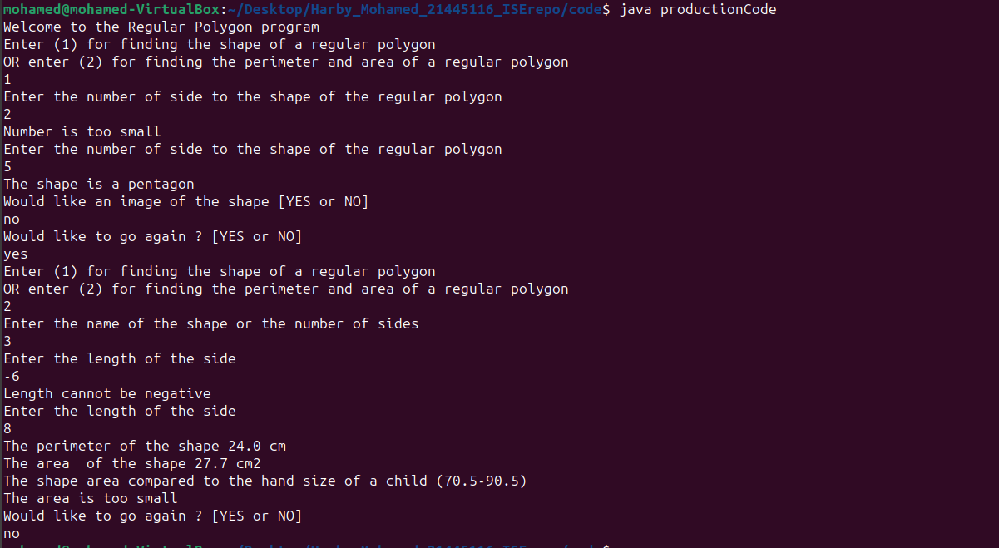
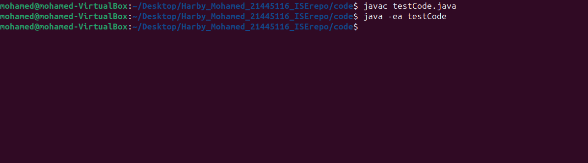
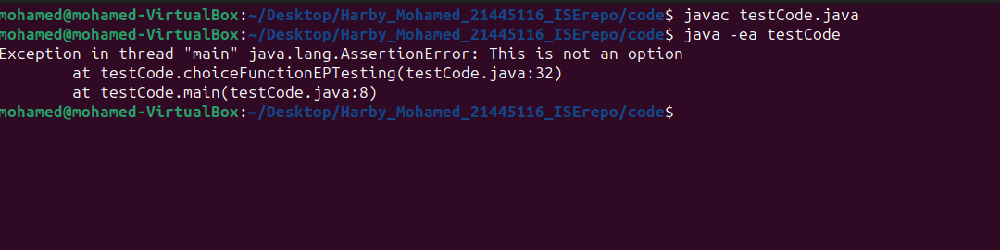
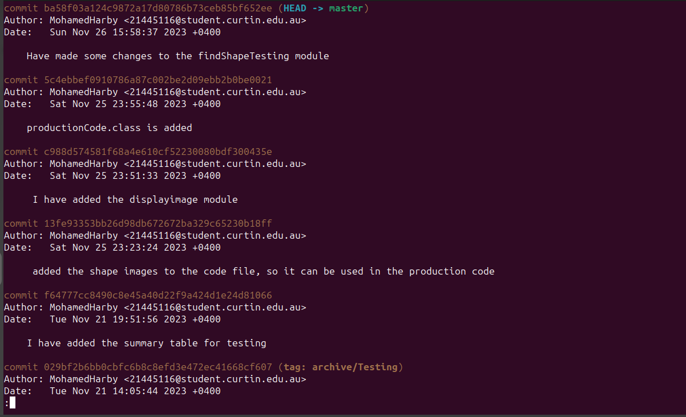
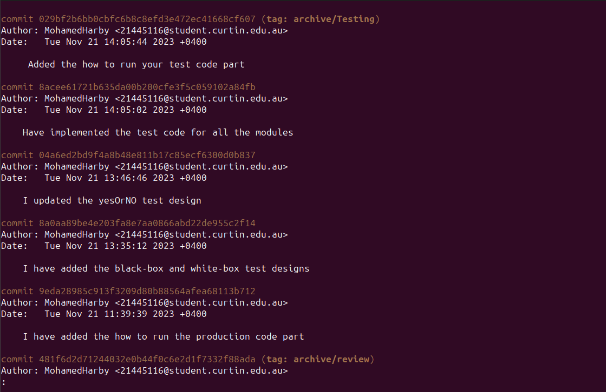
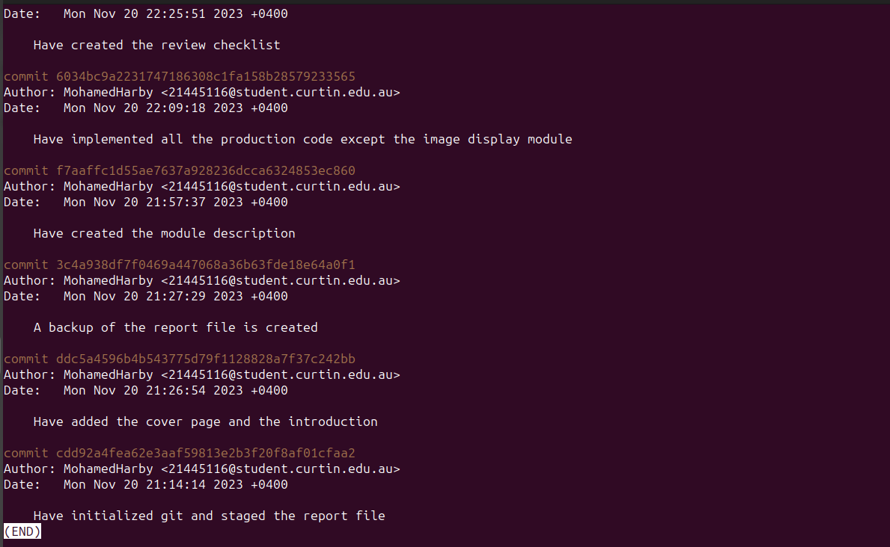

# Final Assessment 
### Done by: Mohamed Ahmed Mohamed Yassin Harby
### Student ID: 21445116
### Due on 29/11/2023 

## Introduction
This system will have two scenarios, which I have implemented. The first will display the name and image of a regular polygon when the user enters the number of sides, and the second will calculate the shape's perimeter and area when the length is entered, then compare the area of the shape to a child's hand. After implementing the code, I created a checklist to check for errors and modularity issues. I then refactored the code, created the Black-box and White-box test designs, and implemented the test code. At the conclusion, there is a discussion and a summary.

## Module Description

### findingShape Module
This module will accept an integer for the number of sides as a parameter and return a string representing the name of the polygon. If the user enters a number outside of the specified range, a while loop will ensure that the user renters the number, and the module will return the name of the regular polygon as a string. This module will not display the image, so it has one task only, to have high cohesion.

### imageOutput Module

In the Main Module, the system will ask the user if they would like to see an image of the shape. If the user answer is  yes, this module will display the appropriate image depending on the value that the findingShape Module returned.

### yesOrNo Module

This module will receive the user's response to the question, "Would they like to see an image of the shape?" Additionally, this module will be used later when the user is asked "would they like to repeat or not?" and will use a while loop to ensure that the response is either yes or no. It will also return the answer as a string.

### findingPerimeter module 

In the Main Module the system will ask the user to enter either the name of the shape or the number of sides and the length of the side, so these will be the parameters of this module and it will print out the perimeter of the shape and it will not return anything. 

### findingArea module

Using the same parameters of the findingPerimeter Module, this module will calculate the area of the shape and print it out and will return the area as a double. 

### comparingHand 

This module will take the returned value from the findingArea module and will compare it to the area the of the hand of a child and then it will print out different statements based on the comparison, this module will not return anything.

Using these modules this will prevent the use of any global variables and make sure there is low coupling and every module has only one function, so high cohesion, also the most parameters in one module is two, to avoid complexity, and there will be a reuse of modules to decrease redundancy. 

## Review Checklist
1 Mathematical operations are only done on real numbers ? 

2 Are the correct data types passed to methods ?

3 Do all string comparisons use ".equals" instead of "==" ?

4 When calling a method, are parameters passed in the correct order ?

5 When a method return a value, is that value being used ?

6 No rounding issues ?

7 Were only local variables being used ?

8 Does every method has only one, well-defined function ?

9 Does All methods have less than 6 parameters ? 

10 Is there any reuse of methods ?

11 No control flags being used ?

12 Low coupling ?

13 High cohesion ? 

14 No method that has two parts, that work with different data ?

## Review 

There is a minor issue in the findingShape method where the print statement could be more descriptive for the wrong values, not just "This is not an available shape".

## Refactor 

All the issues were minor issues, as I kept modularity in mind while coding, but there were a lot of changes made to the modules while coding, so the module description needs to be updated.

## Revised Module Descriptions

### choiceFunction Module 
This module will take the answer of user of the question "if they would like to find the shape of a regular polygon or find the perimeter and the area of a regular polygon" and will return true if the answer is 1 or 2 and will return false if the answer is neither.

### nameOfShape Module 
This module will be used in the second scenario before the user entering the length of the side, and it will take answer (string) of the as a parameter, the question will be to either enter the name of the shape or the number os sides, so using .equals, if the answer is "triangle" or "3"
it will return 3, if the answer is "square" or "4" it will return 4 and if the answer is neither it will return 0.
### negativeValidation Module 

This module will take the length of the side and make sure it is not negative because length cannot be negative. So it will take length as a double and return true if the number is not negative and return false if the number is negative.

## findingShape Module
This module will accept an integer for the number of sides as a parameter and return a string representing the name of the polygon. If the user enters a number outside of the specified range, the module will return "error" otherwise it will return the name of the shape as a string. This module will not display the image, so it has one task only, to have high cohesion.

### imageOutput Module

In the Main Module, the system will ask the user if they would like to see an image of the shape. If the user answer is  yes, this module will display the appropriate image depending on the value that the findingShape Module returned.

### yesOrNo Module

This module will receive the user's response to the question, "Would they like to see an image of the shape?" Additionally, this module will be used later when the user is asked "would they like to repeat or not?" and will use a while loop to ensure that the response is either yes or no. It will also return the answer as a string.

### findingPerimeter module 

In the Main Module the system will ask the user to enter either the name of the shape or the number of sides and the length of the side, so these will be the parameters of this module and it will return the perimeter as a double 

### findingArea module

Using the same parameters of the findingPerimeter Module, this module will calculate the area of the shape and will return the area as a double.

### comparing 

This module will take the returned value from the findingArea module and will compare it to the area the of the hand of a child and then it will print out different statements based on the comparison, this module will not return anything.

## How to run the production code 
The user is given two options. If the user selects option 1, the system will ask the user to enter the number of sides of a regular polygon. Based on the number of sides, the system will print the polygon's name and, if the user desires, display an image. In the event that option 2 is selected, the user will be prompted to input the length of a side, the number of sides, or the name of the polygon. The system will then compute the shape's perimeter and area and compare it to a child's hand, then the system will ask the user whether they would like to go again.

## Black-box test designs

### choiceFunction (Equivalence Partitioning)
| Category | Test Data | Expected Results|
|----------|-----------|-----------------|
| choice = 1 | 1 | True |
| choice = 2 | 2 | True|
|choice!= 1 && choice!=2 | 116 | False|

### findingShape (Equivalence Partitioning)
| Category | Test Data | Expected Results|
|----------|-----------|-----------------|
| numOfSides = 3 | 3 | "Triangle"|
| numOfSides = 4 | 4 | "Square"|
|numOfSides = 5| 5 | "Pentagon"|
| numOfSides = 6| 6 | "Hexagon" |
| numOfSides = 7| 7 | "Heptagon"|
|numOfSides < 0  |-5 | "error"|
|0 >= numOfSides < 3  | 2 | "error"|
|numOfSides > 7  | 116 | "error"|

### yesOrNo (Equivalence Partitioning)
| Category | Test Data | Expected Results|
|----------|-----------|-----------------|
| answer = "YES" | "YES" | "YES"|
| answer = "NO" | "NO" | "NO"|
|answer!= "YES"&& answer != "NO"| "Harby" | "..."|

### nameOfShapeFunction (Equivalence Partitioning)
| Category | Test Data | Expected Results|
|----------|-----------|-----------------|
| answer = "3"| "3" | 3|
| answer = "4"| "4" | 4|
| answer = "TRIANGLE"| "TRIANGLE" | 3|
| answer = "SQUARE"| "SQUARE" | 4 |
| answer!="3" && answer!="4" && answer!="TRIANGLE" && answer!="SQUARE"| "Harby" |0|

### negativeValidation (Equivalence Partitioning)
| Category | Test Data | Expected Results|
|----------|-----------|-----------------|
| answer >= 0| 5.9 | True|
| answer < 0 | -6.8 | False|

### findingPerimeter (Equivalence Partitioning)
| Category | Test Data | Expected Results|
|----------|-----------|-----------------|
| shape = 3, L >=0|3, 6.5| 19.5|
|shape = 4, L >=0| 4, 7.1 | 28.4|
|shape = 3, L <0| 3, -5 | 0|
|shape = 4, L <0| 4, -5 | 0|
|shape!= 3 && shape !=4, L >=0| 5, 5 |0|
|shape!= 3 && shape !=4, L <0| 5, -5 |0|

### findingArea (Equivalence Partitioning)
| Category | Test Data | Expected Results|
|----------|-----------|-----------------|
| shape = 3, L >=0|3, 6.5| 18.3|
|shape = 4, L >=0| 4, 7.1 | 50.4|
|shape = 3, L <0| 3, -5 | 0|
|shape = 4, L <0| 4, -5 | 0|
|shape!= 3 && shape !=4, L >=0| 5, 5 |0|
|shape!= 3 && shape !=4, L <0| 5, -5 |0|

### comparing (Equivalence Partitioning)
| Category | Test Data | Expected Results|
|----------|-----------|-----------------|
| area < 70.5|60.4| "Area is too small"|
|70.5 <= area <= 90.5| 80.6 | "Area is within range"|
|area > 90.5| 100.2 |"Area is too large"|

### comparing (Boundary Value Analysis)
| Boundary | Test Data | Expected Results|
|----------|-----------|-----------------|
| "Area is too small"/ "Area is within range"|70.4| "Area is too small"|
|| 70.5 | "Area is within range"|
|"Area is within range"/ "Area is too large"| 90.5 |"Area is within range"|
|| 90.6 |"Area is too large"|

### how I chose the black-box test cases
I did not look at the code when I was designing the black-box test cases; instead, I focused solely on the inputs and outputs of each module, identified all the test data categories for each module, and then selected the test data.

## White-box test designs

### choiceFunction (If path)
| path | Test Data | Expected Results|
|----------|-----------|-----------------|
| Enter the if  | 116 | false |
| Do not enter the if | 1 | True|

### yesOrNo (Do-while paths)
| Path | Test Data | Expected Results|
|----------|-----------|-----------------|
|No iteration | "NO" | answer = "NO",output""|
|some iteration| "Harby\nYES" | answer = "YES", output "This is not an option"|

### findingPerimeter (If path)
| Path | Test Data | Expected Results|
|----------|-----------|-----------------|
| Enter the part|3, 6.5| 19.5|
|Enter the else if part | 4, 7.1 | 28.4|

### findingArea (If path)
| Path | Test Data | Expected Results|
|----------|-----------|-----------------|
|Enter the part|3, 6.5| 18.3|
|Enter the else if part| 4, 7.1 | 50.4|

### how I chose the white-box test cases
White-box test cases were simpler for me to choose than black-box test cases because I could base my test data on identifying the various paths and having the code.

## How to run the test code 
All of the testing for both black-box and white-box modules is contained in a single test code file. First javac the file "javac testCode.java" and then run "java -ea testCode" to activate assertions. The testing is successful if the code produced nothing; else, the test name would be printed out.

## Summary Table
|  | Design of test cases |||| |Test code implementation and execution| | | 
|----|------|-----|---|---|------|----|---|-----|
| Module name  | BB (EP) | BB (BVA) |WB|Data type/s|  Form of input/output|EP|BVA|WB|
| choiceFunction|Done| Not done|Done|int/boolean|parameters/return values|Done|Not done|Done|
| findingShape|Done| Not done|Not done|int/String|parameters/return values|Done|Not done|Not done|
| yesOrNo|Done| Not done|Done|string|keyboard entry/return values|Done|Not done|Done|
| nameOfShapeFunction|Done| Not done|Not done|String/int|parameters/return values|Done|Not done|Not done|
| negativeValidation|Done| Not done|Not done|double/boolean|parameters/return values|Done|Not done|Not done|
| findingPerimeter|Done| Not done|Done|int/double|parameters/return values|Done|Not done|Done|
| findingArea|Done| Not done|Done|int/double|parameters/return values|Done|Not done|Done|
| comparing|Done| Done|Not done|double|parameters/display on screen|Done|Done|Not done|

## Version control 

after every change, I have staged the file and add a commit, also I used branches, one for testing and one other for reviewing, as I was not sure of these areas and a lot of changes were happening while working on them that is why I used branches.

## Discussion 

I began by writing the module description. After that, I implemented the modules and made many changes to them, including adding and removing some. I also made a review checklist, reviewed the code, and revised the module description. Because I had kept modularity in mind when coding, not many problems were found during the review phase, but the implementation phase caused the module description to change significantly. Together with writing the test code and designing the tests, I also made the summary table. I had to overcome several obstacles. Firstly, I was unsure of how to display the image, so I ended up using jframe, though it still has some issues that need to be fixed. Secondly, I had to create my git repository twice because it got corrupted twice during my testing of the image display module. I believe the root of the issue was that, while I was testing the image display, I added the images to the code file and then deleted it without using staging or commits. I too had some trouble implementing white box testing because I was not particularly confident in the subject, but I managed to grasp the primary concept by going back and reading the slides several times. In the end, I would say that I learnt a lot and had fun. This is the first time I have created a project this size with so many distinct processes and iterations, and I believe this is the essence of software engineering.